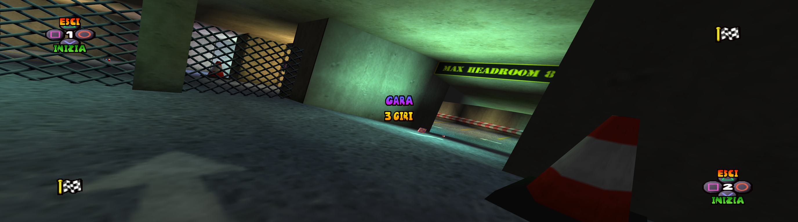
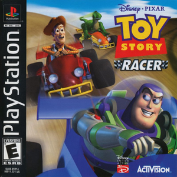

# Toy Story Racer Recompiled

<!-- retcomm-readme-metrics -->
[](https://github.com/IraFunesto/ToyStoryRacerRecomp/releases)
[](https://github.com/IraFunesto/ToyStoryRacerRecomp/releases/latest)
[](https://github.com/IraFunesto/ToyStoryRacerRecomp/releases/latest)
<!-- /retcomm-readme-metrics -->

<p align="center">
  
</p>

Static recompilation of **Disney•Pixar Toy Story Racer** (PlayStation, PAL
SLES-03398, Spanish / Italian / Dutch) built on
[psxrecomp](https://github.com/mstan/psxrecomp) and
[recomp-ui](https://github.com/RetroPortingToolKit/recomp-ui). The game runs
as native code on your PC, compiled from your own disc, with a widescreen mod,
a native 3D renderer for the tracks and a set of fixes on top.



| | |
|---|---|
| Players | 2 (split screen) |
| Region | PAL (Europe) |
| Publisher | Disney Interactive |
| Year | 2001 |

## What this adds

All enhancements live in the bundled **Toy Story Racer Widescreen** mod
package (launcher → Mods) and can be switched off.

**Widescreen** (fit to window, 16:9, 21:9 or 32:9) — a real wider field of
view, not a stretched picture:
- tracks and objects are drawn all the way to the screen edges, in one and two
  player races; the cloud sky of the title and level select fills the width
  too;
- the race HUD is anchored to the corners, and so are the prompts of the
  menus, level select, track preview and pause screen (the character select
  prompts keep following the characters' heads);
- *Track draw distance*: the original hides scenery outside the 4:3 view;
  Extended doubles the draw distance, Full (default) also ignores the 4:3
  visibility lists, so nothing pops in at the sides.

**Native scenery renderer** (default on) — the track scenery, the karts and
the characters are drawn by the PC instead of the emulated PlayStation GPU:
no wobbling textures or jittering polygons, correct depth between pieces, no
polygons cut at the 4:3 edges.

**50 fps races** — the PAL game runs at 25 fps; races can run at 50 fps (one
player by default, two players optional on a fast PC). Game speed and music
are unchanged.

**HUD size** — 100 / 85 / 75 / 65 % (default 85 %): the low-resolution HUD
and menu art is drawn smaller so it looks sharper next to the high-resolution
game.

**Other options**: CPU overclock (races only; keeps two-player races at full
rate), near-polygon pool size, frame smoothing, race progress bar position,
VSync on high-refresh monitors, skip the intro videos.

**Fixes**
- Character voices no longer stall the menus while they load.
- Music changes no longer hitch.
- Pier: a corrupted sea-grid record on the European disc crashed the
  original GPU; broken packets are now dropped instead of halting the game.
- Damaged track data on the European disc (see below).

Plus everything psxrecomp provides: high internal resolution, texture
filtering, save states, controller rumble.

## Damaged track data on the European disc

The European disc has about 45 two-byte values overwritten (`3E 3E` where the
USA disc has `80 3F` / `10 3F`) in ten track files. The visible results are
broken textures and geometry on Skate Park, Pier, Car Lot, Cinema and
Neighbourhood. Apart from those values the track files of both discs are
identical.

The game reads any file placed under `disc_override/` next to the executable
instead of the one on the disc (same path, e.g.
`disc_override/COURSE_B/PIER.AXE`). If you also own the USA disc, copy the
ten repaired files from it with:

```
python tools/extract_us_maps.py "Disney-Pixar Toy Story Racer (USA).bin" <folder of ToyStoryRacer_Recompiled.exe>
```

The tool checks every file against the known USA release before writing it.
The game stays in your European language: only these ten track files change.

## How to play

1. Download the latest zip from
   [Releases](https://github.com/IraFunesto/ToyStoryRacerRecomp/releases/latest)
   and extract it into a new folder.
2. Run `ToyStoryRacer_Recompiled.exe` (Python 3 required).
3. Select your own disc (.cue/.bin of SLES-03398) and follow the
   **Generate & rebuild** wizard: the game is compiled on your PC.
4. Enable **Widescreen** in the launcher's Mods page.
5. Optional: repair the damaged tracks as described above.

The download contains no game data and no Sony BIOS; OpenBIOS (MIT-licensed)
is used when you do not provide your own.

## Framework changes

The game needs a few additions to psxrecomp (a linked-list hook for the menu
prompts, disc file overrides, CD/XA loading, GPU packet safety, CPU overclock
and more). They ship inside the release zip and are kept here as
`patches/psxrecomp-toystoryracer.patch` against the pinned `psxrecomp`
submodule commit.

## Legal

You must own the original game. Disc images and files taken from discs are
gitignored and must never be committed. Retail BIOS dumps are not
redistributed; OpenBIOS is used for Generate unless you supply your own SCPH
locally.

App icon: the Toy Story Racer logo (`assets/psxrecomp.ico` / `.png`); Windows
builds embed it via `APP_ICON`. Launcher box art: `launcher_assets/img/`
(see `BOXART_SOURCE.txt`).

## Quick start (dev)

```bash
git submodule update --init --recursive
git -C psxrecomp apply --ignore-whitespace ../patches/psxrecomp-toystoryracer.patch
./psxrecomp/tools/ci/build_emitters.sh
python3 psxrecomp/psxrecomp_cli.py generate \
  --config game.toml --project-root . --disc disc/<your>.cue
cmake -S . -B build-release -G Ninja -DCMAKE_BUILD_TYPE=Release
cmake --build build-release --target psx-runtime
```

Release kit (setup host, no Sony BIOS):

```bash
cmake -S . -B build-setup -G Ninja -DCMAKE_BUILD_TYPE=Release \
  -DPSXRECOMP_FORCE_SETUP_HOST=ON -DPSXRECOMP_BIOS_STEMS=OpenBIOS
cmake --build build-setup --target psx-runtime
RELEASE_VERSION=x.y.z bash scripts/package_setup_release.sh build-setup windows-x64
```

Zip prefix for CI artifacts: `tsr`.

## Symbols

Progressive map: `symbols.toml` → `python3 tools/sync_symbols.py` →
`psx_symbols.h` (`PSX_FN_*`). See `psxrecomp/docs/SYMBOLS.md`.

## Framework pins

Submodule gitlinks (`psxrecomp`, optional `recomp-ui`, nested `recomp-net`)
are authoritative. `framework_pins.txt` is an optional scaffold snapshot.
Bump submodules deliberately and refresh the patch when you do.
